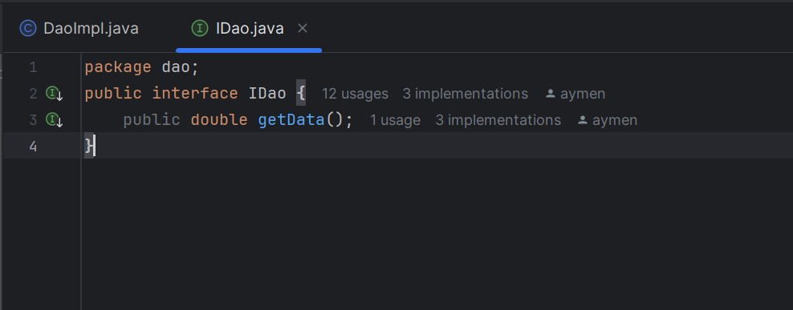
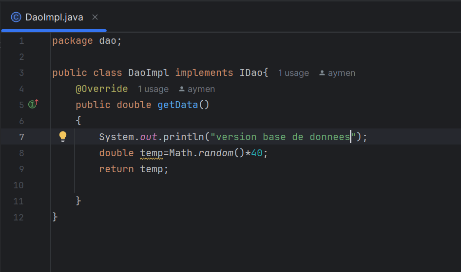
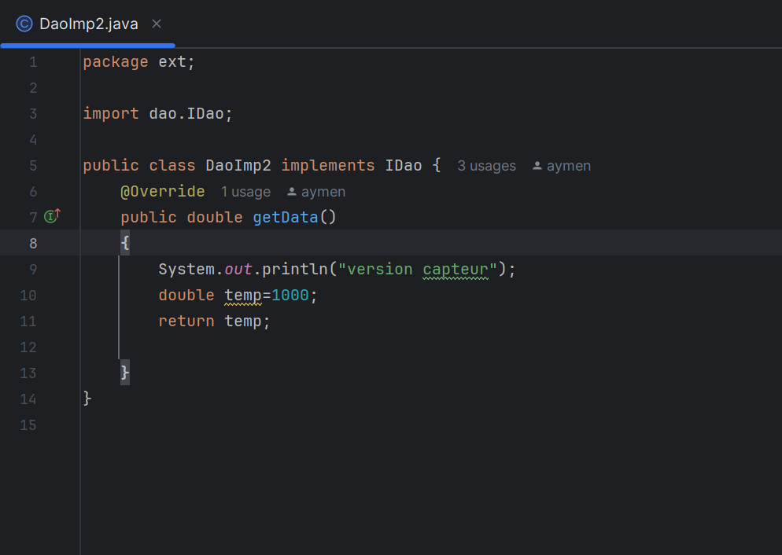
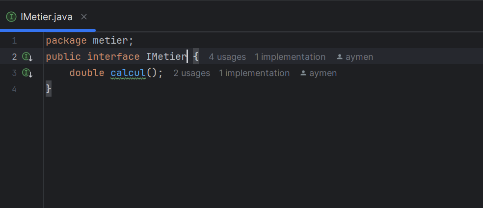
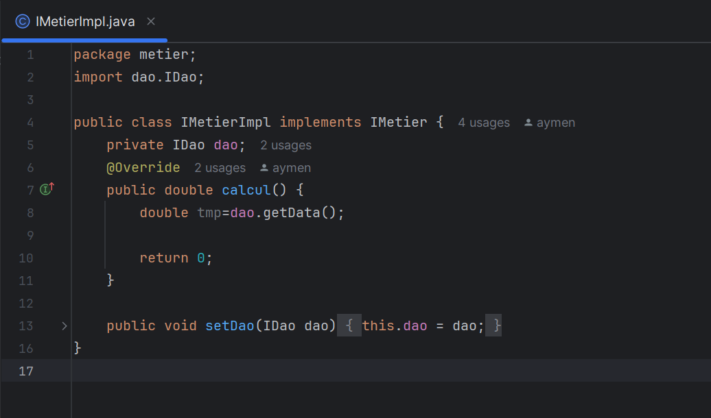
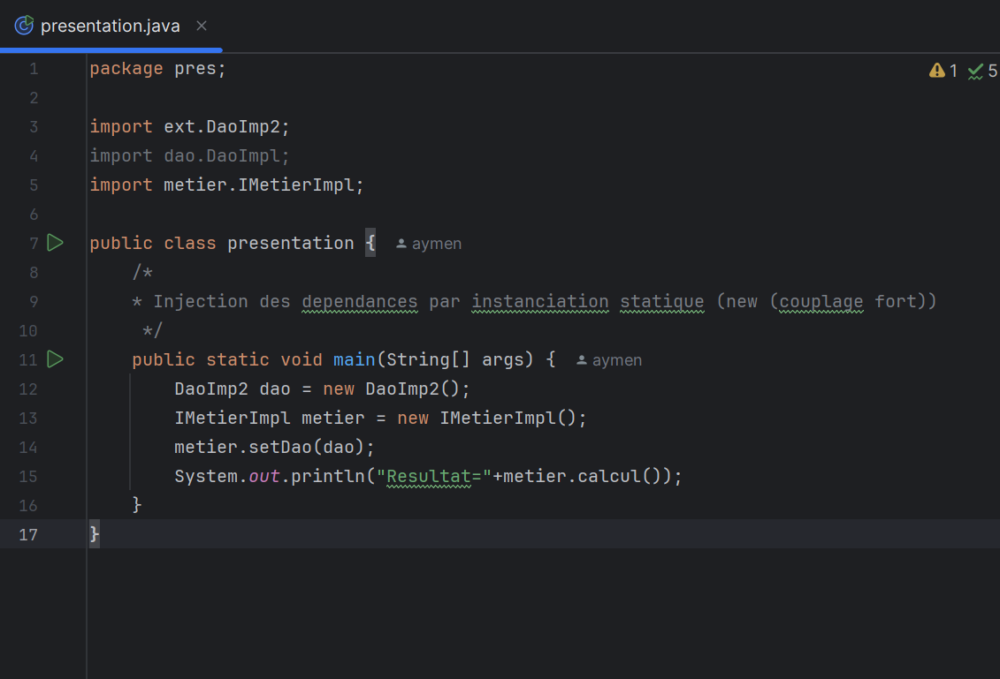
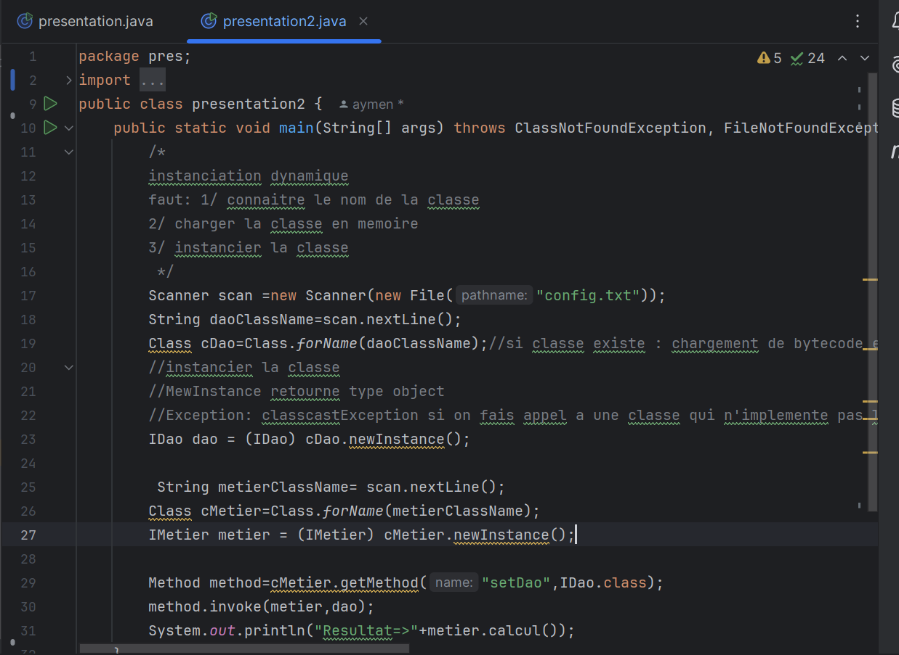

<h2>Compte Rendu Tp1</h2>
<h3>L'interface IDao</h3>

<h3>implémentation 1 de l'interface IDao </h3>

<h3>implémentation 2 de l'interface IDao </h3>

<h3>L'interface IMetier</h3>

<h3>implémentation de l'interface metier</h3>

<h4> Instanciation statique </h4>

<h4> Instanciation dynamique </h4>

